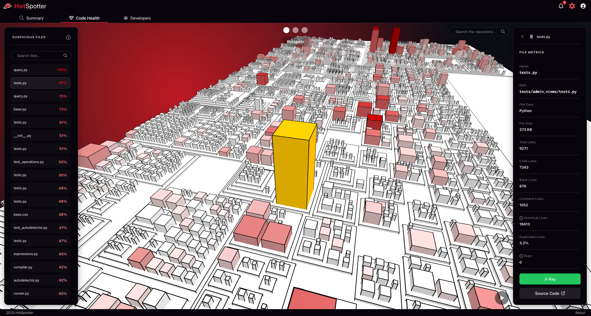

# HotSpotter - Frontend Dashboard


> **Interactive visualization layer for the HotSpotter behavioral analysis system.**

This repository contains the **Frontend** source code for HotSpotter. It provides a rich, interactive interface for exploring code repositories through 3D visualizations ("Code City") and detailed analytical dashboards.

🔗 **Backend Repository:** [https://github.com/SosnowskiMichal/HotSpotter.git](https://github.com/SosnowskiMichal/HotSpotter.git)

---

## 📖 About the Project

**HotSpotter Frontend** transforms raw analytical data provided by the backend into intuitive visual formats. It helps developers and managers understand the dynamics of software evolution by combining structural metrics with historical data from Git.

**Key Visualizations:**

* **3D Code City:** An interactive model where buildings represent files.
    * **Height:** Number of changes (frequency).
    * **Width:** Code size (LOC).
    * **Color:** Heatmap of complexity or recent activity.
* **Hotspot Dashboard:** Charts and tables identifying high-risk files and technical debt.
* **Team Dynamics:** Visualization of the "Bus Factor" and knowledge distribution across the team.

---

## 📸 Screenshots

| 3D Code City Model |
|:---:|
|  |

---

## 🛠️ Tech Stack

The application is built using modern web technologies focusing on performance and interactivity.

* **Framework:** Vue.js 3
* **Build Tool:** Vite
* **Language:** TypeScript
* **Styling:** SCSS
* **3D Visualization:** Three.js
* **2D Charts & Graphs:** D3.js
* **State Management:** Pinia
* **Communication:** Axios

---

## 📂 Project Structure

Here's an overview of the project's directory structure:

-   **`components/`**: Reusable Vue components.
    -   `city/`: Components for building city pages
    -   `common/`: Small, versatile UI components
    -   `modals`: Dialog boxes and popups
    -   `sections`: Larger parts of the interface
    -   `settings`: Settings page components
    -   `visuals`: Graphic elements
-   **`composables/`**: Composables logic.
-   **`locales/`**: Stores translation files for different languages.
-   **`mocks/`**: API and data mocks.
-   **`router/`**: Vue Router configuration.
-   **`services/`**: Files containing business logic and communication with external APIs.
-   **`stores/`**: Pinia modules for global state management.
-   **`styles/`**: SCSS files.
-   **`types/`**: Custom TypeScript types.
-   **`views/`**: Components representing entire pages/views of the application.

---

## 🚀 Getting Started

### Prerequisites
* Node.js (LTS version recommended, e.g., v24+)
* npm

### Installation

1.  **Clone the repository:**
    ```bash
    git clone https://github.com/marg4ryn/HotSpotter.git
    cd HotSpotter
    ```

2.  **Install dependencies:**
    ```bash
    npm install
    ```

3.  **Configuration:**
    Create a `.env` file in the root directory based on the example below.

    ```properties
    VITE_API_URL=http://localhost:8080/api/
    VITE_API_TIMEOUT=30000
    ```

4.  **Run Development Server:**
    ```bash
    npm run dev
    ```

The application will be available at `http://localhost:5173`.

---

## 🐳 Running with Docker (Optional)

If you prefer to run the application using Docker:

1.  **Build the image:**
    ```bash
    docker build -t hotspotter-frontend .
    ```

2.  **Run the container:**
    ```bash
    docker run -d -p 5173:80 hotspotter-frontend
    ```

---

## ⚙️ Configuration Variables

The application is configured via `.env` file.

| Variable | Description |
| :--- | :--- |
| `VITE_API_URL` | The base URL for the Backend REST API. |
| `VITE_API_TIMEOUT` | Request timeout in milliseconds. |

---

## 👥 Project Team

This project was developed as an Engineering Thesis.

**Developers:**

* **Wiktor Piekarski** – *Frontend*
* **Jan Powęski** – *Frontend*
* **Michał Sosnowski** – *Backend*
* **Michał Wąsiński** – *Backend & DevOps*

**Supervisor:**

* **dr inż. Michał Szczepanik**

-----

© 2025 HotSpotter Team
